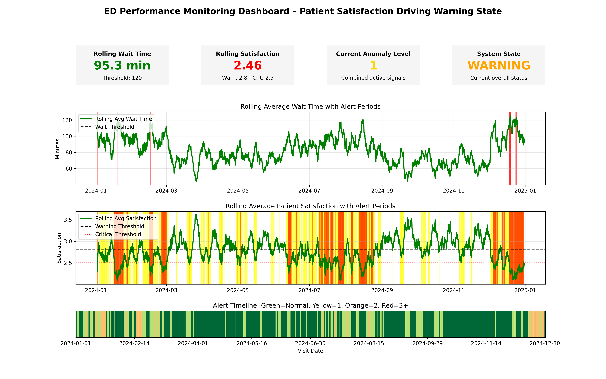

# Continuous Intelligence

This site provides documentation for this project.
Use the navigation to explore module-specific materials.

## How-To Guide

Many instructions are common to all our projects.

See
[⭐ **Workflow: Apply Example**](https://denisecase.github.io/pro-analytics-02/workflow-b-apply-example-project/)
to get these projects running on your machine.

## Project Documentation Pages (docs/)

- **Home** - this documentation landing page
- **Project Instructions** - instructions specific to this module
- **Your Files** - how to copy the example and create your version
- **Glossary** - project terms and concepts

## Custom Project

### Dataset
This project used an Emergency Department (ED) patient flow dataset. The dataset includes fields such as visit datetime, patient wait time, patient satisfaction score, left without being seen (LWBS) rate, and nurse-to-patient ratio.

Each record represents a patient visit or time based observation. A timestamp was created or used to enable time-series analysis of system performance over time.

---

### Signals
Several signals were created to better understand system behavior:

- Rolling average wait time
- Rolling average patient satisfaction
- Rolling LWBS rate
- Rolling nurse-to-patient ratio
- Anomaly count (number of signals outside expected thresholds)

These signals transform raw operational data into meaningful indicators of system performance and patient experience.

---

### Experiments
The continuous intelligence pipeline was extended to apply monitoring techniques to a healthcare setting.

Key modifications included:
- Replacing the original system metrics dataset with an ED patient flow dataset
- Creating rolling averages to observe trends over time
- Adding anomaly detection rules for key signals (high wait time, low satisfaction)
- Introducing a system status classification (Stable, Warning, Critical) based on signal thresholds

These changes allowed the system to move beyond simple monitoring to full system assessment.

---

### Results
The system successfully generated rolling metrics and identified periods of abnormal behavior.

- Increased wait times were often associated with lower patient satisfaction
- Higher LWBS rates appeared during peak wait time periods
- The anomaly detection logic flagged periods where multiple signals were outside acceptable thresholds
- The system classification helped summarize overall performance at each point in time

The output dataset provided a clear and structured view of system health.

---

### Visualization

### Interpretation
This project demonstrates how continuous intelligence techniques can be applied to healthcare operations.

By combining multiple signals, the system provides a real time assessment of ED performance. Instead of reviewing individual items, leaders can quickly determine whether the system is operating normally or requires attention.

For example:
- A "Warning" or "Critical" state may indicate staffing shortages or patient flow issues
- Rising wait times and LWBS rates may signal capacity constraints or staffing issues
- Declining satisfaction scores may reflect patient experience concerns which can be caused by long wait times and staffing shortages

These insights can support operational decisions, resource allocation, and quality improvement efforts in a healthcare setting.

---

## Additional Resources

- [Suggested Datasets](https://denisecase.github.io/pro-analytics-02/reference/datasets/cintel/)
